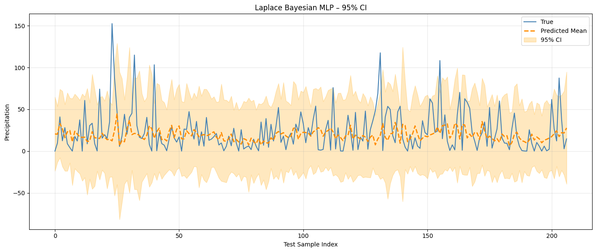

# Benchmarking ML Models for Boston's Weekly Weather




A machine learning project that benchmarks various Bayesian and traditional models for forecasting weekly precipitation in Boston, with emphasis on uncertainty quantification.

## Project Overview

This project compares multiple ML approaches to predict Boston's weekly precipitation patterns while providing uncertainty estimates. We evaluate Bayesian regression models, Gaussian Processes, Bayesian Neural Networks, and Decision Trees using NOAA weather data spanning 2005-2024.

## Repository Structure

```
.
├── data/                      # Data directory
├── Results/                   # Results and output visualizations
├── best_bnn.pt                # Saved weights for the best Bayesian NN model
├── data_cleaning.ipynb        # Notebook for preprocessing and feature engineering
├── LICENSE                    # Project license
├── models.ipynb               # Notebook for model training and evaluation
└── README.md                  # This file
```

## Models Implemented

- **Bayesian Linear & Polynomial Regression** using PyMC3
  - Models with different priors (Gaussian, Gamma)
  - Domain-informed priors based on feature correlations

- **Gaussian Process Regression**
  - Composite kernels: Constant × Squared Exponential
  - Both grid search and Bayesian hyperparameter optimization

- **Bayesian Neural Networks**
  - MLP and RNN with Monte Carlo Dropout
  - Vanilla Bayesian MLP with variational inference
  - Laplace Bayesian MLP for aleatoric uncertainty modeling

- **Decision Tree Regression**
  - Enhanced with rolling statistical features
  - Optimized via hyperparameter tuning

## Key Features

- **Feature engineering** with lagged variables, seasonal indicators, and rolling statistics
- **Uncertainty quantification** using Bayesian methods
- **Comparative analysis** of model accuracy and calibration metrics
- **Visualization** of predictions, uncertainty intervals, and model performance

## Results Summary

| Model                | RMSE ↓ | MAE ↓ | R² ↑    | NLL ↓ | 95% Coverage ↑ |
|----------------------|--------|-------|---------|-------|----------------|
| Bayesian Regression  | 23.63  | 17.97 | -0.07   | 8.998 | 52.17%         |
| Gaussian Process     | 28.50  | 19.41 | -0.44   | 76.837| 13.04%         |
| Laplace BNN          | 26.66  | 17.97 | -0.18   | 4.685 | 92.75%         |
| Decision Tree        | 14.65  | 7.45  | **0.41**| N/A   | N/A            |

The Decision Tree with rolling features achieved the best accuracy metrics, while the Laplace Bayesian Neural Network provided the most well-calibrated uncertainty estimates.

## Getting Started

### Requirements
- Python 3.8+
- PyMC3
- PyTorch
- scikit-learn
- pandas, numpy, matplotlib

### Usage

1. Data preprocessing:
```bash
jupyter notebook data_cleaning.ipynb
```

2. Model training and evaluation:
```bash
jupyter notebook models.ipynb
```

## Contributors

- Muhammad Salman: Neural Network models & feature engineering
- Manivannan Senthil Kumar: Decision Tree models & rolling features
- Nikhil Anil Prakash: Gaussian Process Regression
- Mohit Kakda: Bayesian regression models

## References

1. Gal, Y., & Ghahramani, Z. (2016). Dropout as a bayesian approximation: Representing model uncertainty in deep learning.
2. NOAA GHCND: Global historical climatology network - daily dataset.
3. Scikit-learn GaussianProcessRegressor documentation.